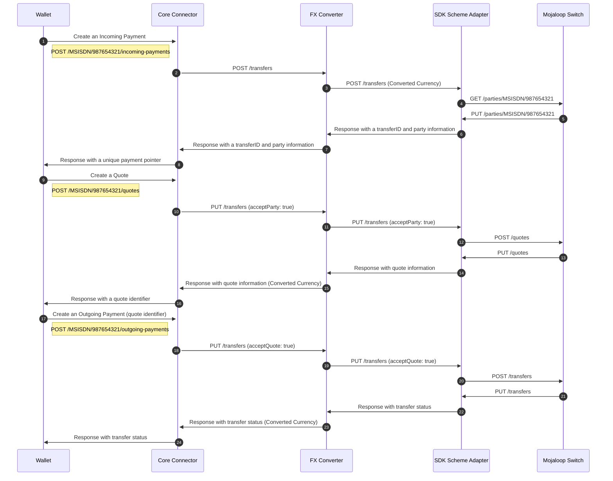

# [EXPERIMENTAL] Open Payments Core Connector

<!-- ACTION: REPLACE sdk-core-connector-openpayments-api-svc placeholders in this document -->
[](https://github.com/mojaloop/sdk-core-connector-openpayments-api-svc/commits/master)
[](https://github.com/mojaloop/sdk-core-connector-openpayments-api-svc/releases)
[](https://www.npmjs.com/package/@mojaloop/sdk-core-connector-openpayments-api-svc)
[](https://www.npmjs.com/package/@mojaloop/sdk-core-connector-openpayments-api-svc)
[](https://circleci.com/gh/mojaloop/sdk-core-connector-openpayments-api-svc)

[EXPERIMENTAL] An initial implementation of OpenPayments Core Connector. It connects a system to SDK Scheme Adapter using OpenPayments API.

`This repository is still under development`

## Contributing

Refer to [CONTRIBUTING.md](./CONTRIBUTING.md) for information on how to contribute, committing changes, releases and snapshots.

---

## Overview

This repository is an initial implementation for the OpenPayments core connector.


## Sequence Diagram



## Get Started

### Pre-requisites
- git
- docker

### Running the docker stack

```bash
git clone https://github.com/mojaloop/sdk-core-connector-openpayments-api-svc.git
cd sdk-core-connector-openpayments-api-svc
docker compose up
```

### Making a transfer using Testing Toolkit UI
- Open TTK UI on `http://localhost:6060`
- Open the menu item `Test Runner` in TTK UI in a new tab
- Click on `Collection Manager` button and import the file 'testing-toolkit/collections/payer-tests/sendmoney_auto_acceptance.json'
- Click on `Send` button
- And go to tab `Demo View` and observe the requests and responses for each request


## Development

### Install dependencies

```bash
npm install
```

## Build

Command to transpile Typescript into JS:

```bash
npm run build
```

Command to LIVE transpile Typescript into JS live when any changes are made to the code-base:

```bash
npm run watch
```

## Run

```bash
npm start
```

## Tests

```bash
npm test
```